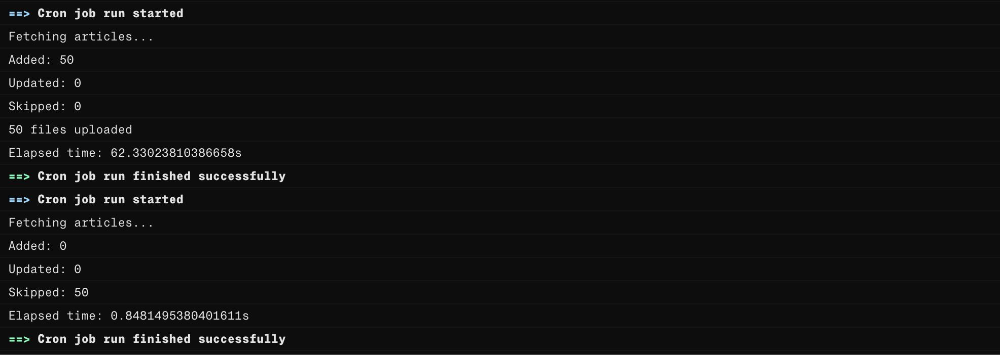
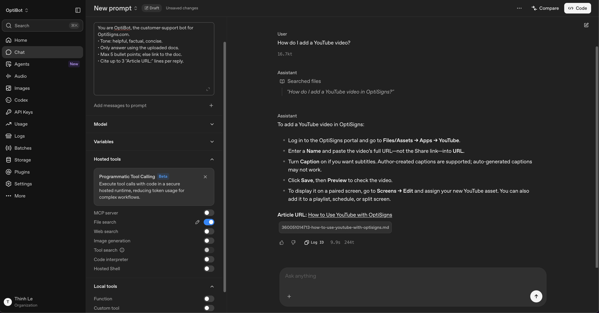

## Automated Zendesk RAG Pipeline

An automated scraper that runs everyday to scrape articles from ZenDesk, parses them to Markdown and syncs those to an OpenAI Assistant vector index

---

## Chunking & Embedding Strategy

- Strategy: Local Context-Preserving Markdown Parsing.
- Chunking Strategy: Fixed-size sliding window strategy. (OpenAI's default strategy)
- Embedding Model: text-embedding-3-large
- Context Injection: Every single individual document is injected with its source parent Article URL metadata line at the absolute top of the snippet before vector generation. This guarantees that no matter how deep a section is when retrieved by the AI, the source URL remains accessible for assistant citations.
- Metadata Association: Every uploaded file to Vector Store has a metadata (atributes) property with article_id and updated_at to be used later to construct a manifest to find out which article should either be added/updated/skipped.

---

## Setup## 1. Prerequisites

Ensure you have the following installed locally:

- Python 3.11+
- Docker (Optional, for local container testing)

## 2. Environment Variables Configuration

Create a `.env` file in the root directory of your project to safely store your developer credentials.

```
ZENDESK_BASE_URL=
OPENAI_API_KEY=
VECTOR_STORE_ID=
SHOULD_FETCH_ALL_ARTICLES=
```

Set `SHOULD_FETCH_ALL_ARTICLES=True` to enable loading all articles, but note that it will process slower and easiler to hit rate limit

---

## How to Run Locally

1.  Create and Activate a Virtual Environment:

`python3 -m venv .venv`

`source .venv/bin/activate`

On Windows use: `.venv\Scripts\activate`

2.  Install Dependencies:

`pip install -r requirements.txt`

3.  Execute the Synchronization Pipeline:

`python src/main.py` or `python3 src/main.py`

---

## Production Architecture & Logs

The script is deployed on Render as a headless, state-protected Daily Cron Job.
Because Render’s container filesystem is completely stateless (ephemeral), the script bypasses traditional local JSON database trackers and uses OpenAI’s Vector Store API as its live database state. Every day on startup, it dynamically reads the vector file metadata layer to rebuild its tracking footprint and identify data updates without creating duplicates.

- Live Daily Job Logs:



---

## Validation Sanity Check

Below is a validation check running against the assistant core to verify compliance with the architectural directives.

## Sample Query: "How do I add a YouTube video?"

## Result


